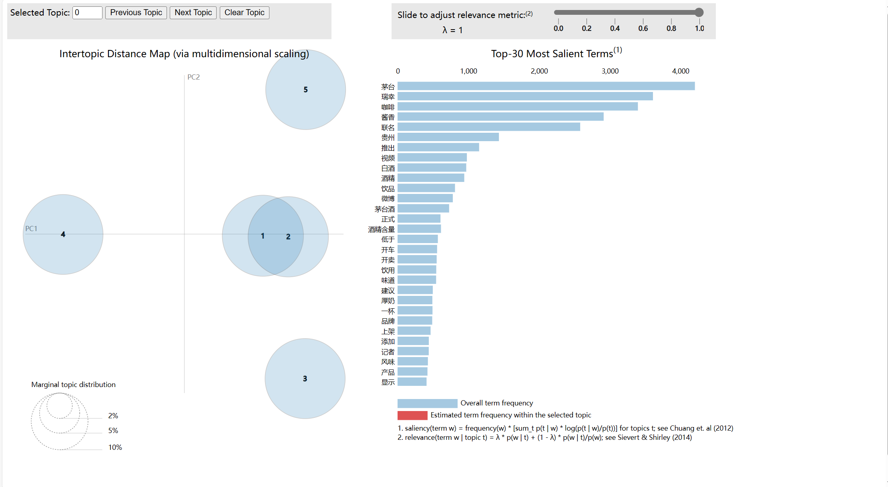

# 瑞幸联名：爬虫+LDA主题分析

## 爬取数据

爬虫代码源自[weibo-search](https://github.com/dataabc/weibo-search)；
请依照源文档设置`settings.py`中的cookie等参数。

运行程序：

```python
$ scrapy crawl search -s JOBDIR=crawls/search
```
结果存储在`结果文件`文件夹下，csv格式。

## LDA 主题分析

首先进行jieba分词，关键词分析与词云图绘制:`jiebaword.py`
得到：
- `output.csv`，分词结果文件
- `keywords.txt`，关键词列表
- `词云.jpg`，词云结果:


LDA主题分析，主要内容：`LDA_2.py`
得到主题分析结果`topic.html`


